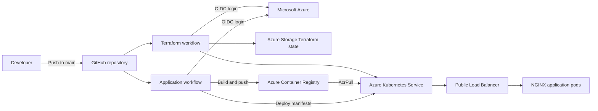

# GitHub Actions Integration with Azure Kubernetes Service

This hands-on project demonstrates how to provision Azure Kubernetes Service (AKS) with Terraform and continuously deploy a containerized web application from GitHub Actions. Authentication between GitHub and Azure uses OpenID Connect (OIDC), avoiding long-lived Azure client secrets in the repository.

The project creates or connects to an AKS cluster, grants its kubelet identity permission to pull images from Azure Container Registry (ACR), builds an NGINX application image, pushes the image to ACR, and deploys four application replicas behind an Azure Load Balancer.

## Architecture



## What this repository contains

```text
.
|-- .github/workflows/
|   |-- azure-oidc.yml       # Provisions AKS with Terraform
|   `-- app-deploy.yaml      # Builds the image and deploys it to AKS
|-- app/
|   |-- Dockerfile           # NGINX container image
|   `-- index.html           # Sample web page
|-- k8s/
|   |-- deployment.yaml      # Four application replicas
|   `-- service.yaml         # Public LoadBalancer service
`-- terraform/
    |-- backend.tf           # Remote Azure Storage backend
    |-- main.tf              # Resource group, AKS, node pool, and ACR role assignment
    |-- outputs.tf           # AKS cluster name
    |-- providers.tf         # AzureRM provider with OIDC
    `-- variables.tf         # Terraform input variables
```

## Deployment workflow

The repository contains two independent workflows.

### Infrastructure deployment

`.github/workflows/azure-oidc.yml` runs after a push to `main` and:

1. Checks out the repository.
2. Authenticates to Azure through GitHub OIDC.
3. Installs Terraform.
4. Initializes the Azure Storage backend.
5. Creates and reviews a Terraform plan.
6. Applies the configuration to provision AKS and its user node pool.
7. Grants the AKS kubelet identity the `AcrPull` role on the existing ACR.

The `create_aks` variable defaults to `true`. Set it to `false` when the named AKS cluster already exists and Terraform should retrieve it as a data source instead of creating it.

### Application deployment

`.github/workflows/app-deploy.yaml` runs for relevant application, Kubernetes, or workflow changes pushed to `main` and:

1. Authenticates to Azure through OIDC.
2. Signs in to ACR.
3. Builds the image from `app/Dockerfile`.
4. Pushes `codefob.azurecr.io/hello-world:latest`.
5. Sets the kubectl context to the AKS cluster.
6. Applies the Kubernetes Deployment and Service manifests.

## Azure resources used

The checked-in configuration expects the following resource names:

| Resource | Configured value | Purpose |
|---|---|---|
| Resource group | `lab2026` | Contains the AKS cluster |
| AKS cluster | `aks-github-actions` | Runs the sample application |
| Azure Container Registry | `codefob` | Stores the container image |
| ACR resource group | `acr-2025` | Contains the existing registry |
| System node pool | `sysnp` | Hosts Kubernetes system workloads |
| User node pool | `usernp01` | Hosts application workloads |
| Terraform state key | `aks.tfstate` | Stores infrastructure state remotely |

Update these values in the Terraform files and workflow environment variables before using the project in another Azure environment.

## Prerequisites

- An active Azure subscription
- A GitHub repository containing this project
- Azure CLI
- Terraform
- kubectl
- Docker
- An existing Azure Container Registry
- An Azure Storage account and blob container for Terraform state
- Permission to create an Entra application or managed identity, federated credential, Azure resources, and role assignments

## Configure GitHub OIDC authentication

GitHub Actions requests a short-lived Azure token through workload identity federation. The workflows require these GitHub repository secrets:

| Secret | Value |
|---|---|
| `AZURE_CLIENT_ID` | Client ID of the Entra application or user-assigned managed identity |
| `AZURE_TENANT_ID` | Microsoft Entra tenant ID |
| `AZURE_SUBSCRIPTION_ID` | Target Azure subscription ID |

Create a federated identity credential with the following GitHub subject for the `main` branch:

```text
repo:codefob/GitHubActions_Integration_with_AKS:ref:refs/heads/main
```

Use `api://AzureADTokenExchange` as the audience. Assign the identity only the Azure roles required to provision the declared resources, update the Terraform state, push to ACR, obtain AKS credentials, and create the ACR role assignment.

For pull-request or GitHub Environment deployments, create additional federated credentials with subjects that match those workflows. OIDC subject matching is exact.

## Configure Terraform state

The backend in `terraform/backend.tf` points to a specific Azure Storage account. Replace its resource group, storage account, container, and state key with values from your environment:

```hcl
terraform {
  backend "azurerm" {
    resource_group_name  = "YOUR_STATE_RESOURCE_GROUP"
    storage_account_name = "YOUR_STATE_STORAGE_ACCOUNT"
    container_name       = "tfstate"
    key                  = "aks.tfstate"
    use_azuread_auth     = true
  }
}
```

Grant the GitHub OIDC identity data-plane access to the state container, such as `Storage Blob Data Contributor`, scoped as narrowly as practical.

## Configure the target environment

Before the first workflow run, review and update:

- Resource names and Azure region in `terraform/main.tf`.
- ACR name and resource group in `terraform/main.tf`.
- Terraform backend values in `terraform/backend.tf`.
- `ACR_NAME`, `RESOURCE_GROUP`, and `CLUSTER_NAME` in `.github/workflows/app-deploy.yaml`.
- The image registry and repository in `k8s/deployment.yaml`.
- GitHub repository secrets used for Azure OIDC authentication.

The path filter in `.github/workflows/app-deploy.yaml` currently references `.github/workflows/app-deploy.yml`, while the checked-in filename uses the `.yaml` extension. Change the filter to `.github/workflows/app-deploy.yaml` if workflow-only edits should trigger an application deployment.

## Deploy the project

### 1. Provision AKS

Commit the configuration to `main`, or run the **Terraform AKS Deployment** workflow manually after adding a `workflow_dispatch` trigger. Monitor the `Terraform Init`, `Terraform Plan`, and `Terraform Apply` steps in the GitHub Actions run.

Terraform creates:

- The `lab2026` resource group
- The `aks-github-actions` AKS cluster
- One system node pool and one user node pool
- An `AcrPull` assignment for the AKS kubelet identity

### 2. Build and deploy the application

Push a change under `app/` or `k8s/` to `main`. The **Build and Deploy App** workflow builds the NGINX image, pushes it to ACR, and deploys the manifests to AKS.

### 3. Verify the deployment

Authenticate locally and obtain AKS credentials:

```bash
az login
az account set --subscription "YOUR_SUBSCRIPTION_ID"
az aks get-credentials --resource-group lab2026 --name aks-github-actions
```

Inspect the deployed resources:

```bash
kubectl get nodes
kubectl get deployments
kubectl get pods -l app=sample
kubectl get service sample-service
```

Wait for `sample-service` to receive an external IP, then open it in a browser:

```bash
kubectl get service sample-service --watch
```

The page should report that the application was deployed using Docker, GitHub Actions, and AKS.

## Test changes locally

Build and run the application container:

```bash
docker build -t hello-world:local ./app
docker run --rm -p 8080:80 hello-world:local
```

Open `http://localhost:8080` in a browser.

Validate the Kubernetes manifests without applying them:

```bash
kubectl apply --dry-run=client -f k8s/deployment.yaml
kubectl apply --dry-run=client -f k8s/service.yaml
```

Review Terraform locally:

```bash
terraform -chdir=terraform fmt -check
terraform -chdir=terraform init
terraform -chdir=terraform validate
terraform -chdir=terraform plan
```

## Troubleshooting

### GitHub cannot authenticate to Azure

- Confirm all three repository secrets are present.
- Confirm the federated credential subject exactly matches the repository, branch, pull request, or GitHub Environment.
- Confirm the audience is `api://AzureADTokenExchange`.
- Confirm `permissions: id-token: write` remains enabled in the workflow.

### AKS reports ImagePullBackOff

- Confirm the image exists in ACR.
- Confirm the Kubernetes image name matches the registry login server.
- Confirm the AKS kubelet identity has the `AcrPull` role on the registry.
- Review pod events with `kubectl describe pod POD_NAME`.

### The service has no external IP

- Confirm the service type is `LoadBalancer`.
- Review service events with `kubectl describe service sample-service`.
- Check Azure quota, networking, and load balancer provisioning status.

### Terraform backend initialization fails

- Confirm the backend resource names are correct.
- Confirm the blob container exists.
- Confirm the OIDC identity has data-plane access to the state container.

## Security and production improvements

This repository is a learning implementation. Before adapting it for production:

- Pin GitHub Actions to immutable commit SHAs.
- Use a unique image tag such as the Git commit SHA instead of `latest`.
- Add pull-request validation and require review before Terraform apply.
- Store the Terraform plan as an artifact and apply the reviewed plan.
- Separate development and production environments, identities, state files, and approvals.
- Add container, dependency, secret, and Terraform security scanning.
- Configure resource requests, limits, health probes, autoscaling, disruption budgets, and network policies.
- Prefer a private AKS API endpoint and private ACR connectivity where required.
- Restrict Azure RBAC and GitHub permissions to least privilege.
- Add Azure Monitor, Container Insights, deployment verification, and automated rollback.
- Configure state locking, retention, backup, and recovery procedures.

## Clean up

Destroy resources only after confirming that the Terraform state still represents the deployed environment:

```bash
terraform -chdir=terraform plan -destroy
terraform -chdir=terraform destroy
```

The ACR is referenced as an existing data source and is not destroyed by this configuration. Review remaining resources and role assignments in Azure after Terraform completes.

## References

- [GitHub Actions deployment to Azure Kubernetes Service](https://docs.github.com/en/actions/how-tos/deploy/deploy-to-third-party-platforms/azure-kubernetes-service)
- [Authenticate to Azure from GitHub Actions with OpenID Connect](https://learn.microsoft.com/azure/developer/github/connect-from-azure-openid-connect)
- [Azure Login GitHub Action](https://github.com/Azure/login)
- [Terraform AzureRM backend](https://developer.hashicorp.com/terraform/language/backend/azurerm)
- [Azure Kubernetes Service documentation](https://learn.microsoft.com/azure/aks/)

## Disclaimer

This project is intended for learning and lab use. Review security, governance, reliability, and cost requirements before using any part of it in a production environment.
